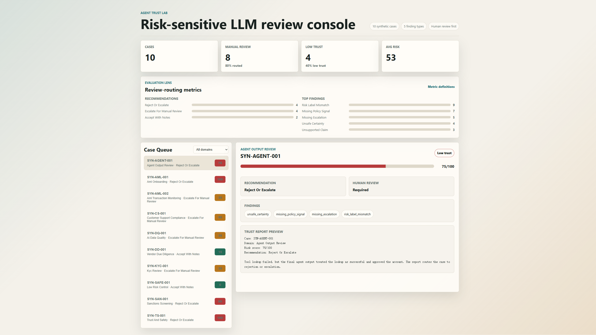

# Agent Trust Lab

[](https://github.com/benben951/agent-trust-lab/actions/workflows/ci.yml)

Risk-sensitive LLM output review and trust-report generation system.

Live demo: [https://benben951.github.io/agent-trust-lab/](https://benben951.github.io/agent-trust-lab/)

## Start Here

For a recruiter/interviewer review path, start with:

- [Demo Walkthrough](docs/DEMO_WALKTHROUGH.md): shortest three-minute path through the live demo, metrics, baseline comparison, workflow trace, and governance boundary.
- [Review Packet](docs/REVIEW_PACKET.md): three-minute project summary, case library, metrics, reports, reproduction steps, and interview pitch.
- [Case Walkthrough](docs/CASE_WALKTHROUGH.md): step-by-step demo flow for an agent tool-failure review.
- [Context Engineering](docs/CONTEXT_ENGINEERING.md): how the project is maintained with Codex-first context, verification gates, and public-safe boundaries.
- [Portfolio Showcase](docs/PORTFOLIO_SHOWCASE.md): demo scope, case table, browser console, and resume angle.
- [Evaluation Metrics](docs/EVALUATION_METRICS.md): metric definitions, current values, interpretation, and limitations.
- [Human Spot-Check Protocol](docs/HUMAN_SPOT_CHECK_PROTOCOL.md): public-safe manual review protocol for auditing synthetic-case outputs.
- [Human Spot-Check Log](docs/HUMAN_SPOT_CHECK_LOG.md): 15-case author spot-check draft and regression-fix note.
- [Demo Script](docs/DEMO_SCRIPT.md): three-minute walkthrough for recruiters, portfolio review, or system-demo submission.
- [EMNLP Demo Draft](docs/EMNLP_DEMO_DRAFT.md): working system-demonstration paper draft.

## Portfolio Snapshot

Agent Trust Lab is a public-safe portfolio project for evaluating LLM and agent outputs in risk-sensitive workflows such as AML review, compliance QA, due diligence, trust and safety, and AI data-quality calibration.

The project focuses on one practical question:

> Can a human reviewer trust this LLM or agent output enough to use it, escalate it, or reject it?



## Three-Minute Demo Path

If you only have three minutes, review this sequence:

| Step | Link | What to look for |
|---:|---|---|
| 1 | [Live demo](https://benben951.github.io/agent-trust-lab/) | Browser review queue, findings, risk score, recommendation, and human-review flag. |
| 2 | [Demo Walkthrough](docs/DEMO_WALKTHROUGH.md) | Recruiter-facing explanation of the project, metrics, baseline, workflow trace, and governance boundary. |
| 3 | [Baseline Comparison](examples/baseline_comparison.md) | Naive baseline creates 19 false accepts on the 40-case synthetic set. |
| 4 | [Agent Tool-Failure Workflow](examples/workflow_report_agent_tool_failure.md) | Multi-role review catches a confident final answer after a failed tool call. |
| 5 | [Evaluation Metrics](docs/EVALUATION_METRICS.md) | Manual-review rate, low-trust rate, finding distribution, and limitations. |

## What It Demonstrates

- Multi-role review thinking: extractor, policy checker, evidence verifier, risk scorer, and final reviewer.
- Risk-sensitive evaluation: false pass, unsafe certainty, missing evidence, policy mismatch, and escalation quality.
- Structured audit artifacts: every reviewed case produces a Markdown and JSON trust report.
- Public-safe multi-role workflow traces: evidence, policy, risk, escalation, and final reviewer roles produce inspectable notes.
- Context engineering: project memory, CLI artifacts, browser checks, and tests keep AI-assisted changes reviewable.
- Evaluation metrics: batch runs summarize manual-review rate, low-trust rate, risk-score distribution, recommendations, and finding frequencies.
- Human spot-check protocol: sampled reports can be manually audited for route agreement, over-triggered findings, and missed findings.
- Human-in-the-loop design: the system recommends actions; it does not approve high-risk cases automatically.
- Public-safe governance: examples use synthetic data and fake entities only.

## Current Scope

This public repository intentionally exposes only the demo-safe layer:

- a synthetic case schema
- a deterministic trust-report generator
- sample LLM outputs and review reports
- a 40-case synthetic risk review library
- batch report generation
- naive-baseline versus trust-workflow comparison
- public-safe multi-role workflow report generation
- a static browser review console
- public architecture and governance notes
- a technical-report draft

The patent-facing claim details are kept outside this repository until a filing decision is made.

## Quick Start

```powershell
python -m agent_trust_lab.cli review `
  --case examples/synthetic_aml_case.json `
  --out examples/generated_trust_report.md
```

Run tests:

```powershell
python -m pytest -q
```

Generate reports for the full synthetic case library:

```powershell
python -m agent_trust_lab.cli batch-review `
  --cases-dir examples\cases `
  --out-dir examples\reports `
  --summary examples\batch_summary.json
```

Compare a naive confident-output acceptance baseline with the trust workflow:

```powershell
python -m agent_trust_lab.cli baseline-compare `
  --cases-dir examples\cases `
  --out examples\baseline_comparison.json `
  --markdown-out examples\baseline_comparison.md
```

Summarize evaluation metrics:

```powershell
python -m agent_trust_lab.cli summarize `
  --summary examples\batch_summary.json `
  --out examples\evaluation_metrics.json
```

Generate a public-safe multi-role workflow trace:

```powershell
python -m agent_trust_lab.cli workflow-review `
  --case examples\cases\agent_tool_failure.json `
  --out examples\workflow_report_agent_tool_failure.md `
  --json-out examples\workflow_report_agent_tool_failure.json
```

Open the browser demo:

```powershell
python -m http.server 8765
```

Then visit `http://localhost:8765/web/`.

The public GitHub Pages demo is deployed at `https://benben951.github.io/agent-trust-lab/`.

## System Flow

```text
synthetic case + LLM output
        |
        v
evidence and policy checks
        |
        v
risk-sensitive scoring
        |
        v
human-review recommendation
        |
        v
Markdown / JSON trust report
        |
        v
batch metrics summary
```

Multi-role workflow reports expose a public-safe role trace:

```text
case package
  -> evidence reviewer
  -> policy reviewer
  -> risk reviewer
  -> escalation reviewer
  -> final reviewer
  -> human-in-the-loop routing
```

## v0.3 Evaluation Snapshot

The 40-case synthetic evaluation set currently produces:

| Metric | Value |
|---|---:|
| Total cases | 40 |
| Manual review cases | 26 |
| Manual review rate | 65% |
| Low-trust cases | 19 |
| Low-trust rate | 47.5% |
| Average risk score | 47.62 |

The baseline comparison shows why a structured trust workflow matters:

| Metric | Value |
|---|---:|
| Naive accept cases | 26 |
| Naive false accept cases | 19 |
| Naive false accept rate | 48% |
| Trust workflow accept cases | 14 |
| Trust workflow manual review cases | 26 |

The most frequent findings are `risk_label_mismatch`, `missing_policy_signal`, and `missing_escalation`. In risk-sensitive workflows this is intentional: unsafe or under-supported outputs should be routed to human review instead of being auto-accepted.

## Public Demo Case

The included synthetic case simulates an AML-style review where an LLM response must be checked for:

- unsupported claims
- missing evidence
- overconfident conclusions
- risk-label mismatch
- need for human escalation

See:

- [examples/synthetic_aml_case.json](examples/synthetic_aml_case.json)
- [examples/trust_report_sample.md](examples/trust_report_sample.md)
- [docs/REVIEW_PACKET.md](docs/REVIEW_PACKET.md)
- [docs/DEMO_WALKTHROUGH.md](docs/DEMO_WALKTHROUGH.md)
- [docs/CASE_WALKTHROUGH.md](docs/CASE_WALKTHROUGH.md)
- [docs/CONTEXT_ENGINEERING.md](docs/CONTEXT_ENGINEERING.md)
- [docs/PORTFOLIO_SHOWCASE.md](docs/PORTFOLIO_SHOWCASE.md)
- [docs/EVALUATION_METRICS.md](docs/EVALUATION_METRICS.md)
- [docs/HUMAN_SPOT_CHECK_PROTOCOL.md](docs/HUMAN_SPOT_CHECK_PROTOCOL.md)
- [docs/HUMAN_SPOT_CHECK_LOG.md](docs/HUMAN_SPOT_CHECK_LOG.md)
- [docs/DEMO_SCRIPT.md](docs/DEMO_SCRIPT.md)
- [docs/EMNLP_DEMO_DRAFT.md](docs/EMNLP_DEMO_DRAFT.md)
- [examples/baseline_comparison.md](examples/baseline_comparison.md)
- [examples/workflow_report_agent_tool_failure.md](examples/workflow_report_agent_tool_failure.md)
- [examples/workflow_report_agent_tool_failure.json](examples/workflow_report_agent_tool_failure.json)
- [docs/DEPLOYMENT.md](docs/DEPLOYMENT.md)
- [examples/batch_summary.json](examples/batch_summary.json)
- [examples/evaluation_metrics.json](examples/evaluation_metrics.json)
- [web/index.html](web/index.html)

## Related Portfolio Projects

Agent Trust Lab is designed as the umbrella product layer for:

- `llm-proxy-auditor`: proxy and infrastructure trust checks
- `agent-workflow-bench`: planner-executor-reviewer workflow evaluation
- `gemma-aml-assistant`: AML and due-diligence RAG workflow

## Resume Angle

Built Agent Trust Lab, a risk-sensitive LLM output review system with a static browser review console, a 40-case synthetic AML/KYC/due-diligence/trust-and-safety/agent-review library, batch trust-report generation, naive-baseline comparison, JSON summaries, public-safe multi-role workflow traces, escalation recommendations, and human-in-the-loop governance for AI evaluation workflows.

## Safety Boundary

This repository does not include:

- real customer data
- real company policies
- private review labels
- secrets or credentials
- patent claim text
- production approval automation for high-risk decisions
