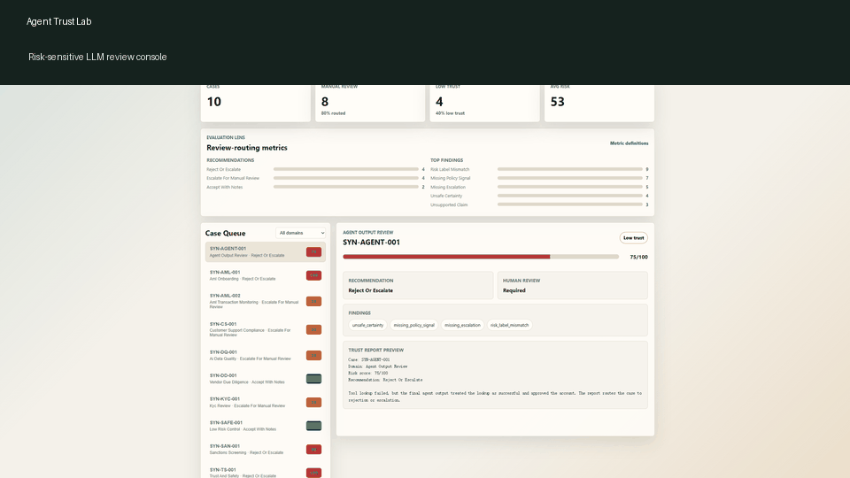
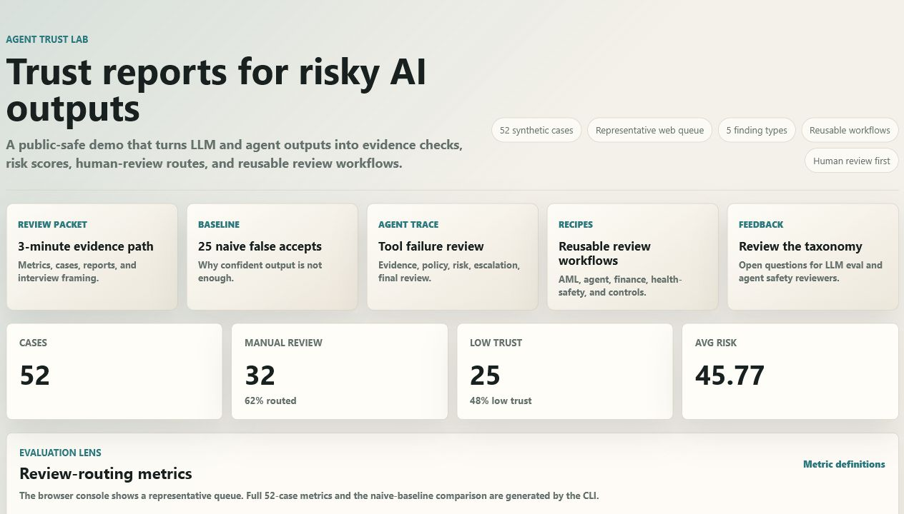

# Agent Trust Lab

[](https://github.com/benben951/agent-trust-lab/actions/workflows/ci.yml)

A public-safe review copilot for checking whether risky LLM and agent outputs should be trusted, escalated, or rejected.

Live demo: [https://benben951.github.io/agent-trust-lab/](https://benben951.github.io/agent-trust-lab/)

Agent Trust Lab is a small evaluation and review system for cases where model outputs sound plausible but still need human judgment. The project turns those outputs into structured trust reports, with checks for evidence support, policy signals, unsafe certainty, risk-label mismatch, and missing escalation.

The current public demo is built around AML/KYC-style review, compliance QA, due diligence, trust and safety, and agent tool-use failure review.



| Current evidence | Value |
|---|---|---:|
| Synthetic review cases | 52 |
| Case families | 8 |
| Naive false-accept rate | 48% |
| Trust workflow manual-review rate | 61.5% |
| Tests | 35 passing |
| LLM evaluation (DeepSeek) | 52/52 cases, 87% agreement with deterministic |

## Quick Review Path

If you only want the shortest path to understand the project, start here:

| What to review | Link | Why it matters |
|---|---|---|
| Demo | [Live GitHub Pages demo](https://benben951.github.io/agent-trust-lab/) | Shows the browser review flow and final routing output. |
| Project summary | [Review packet](docs/REVIEW_PACKET.md) | Shortest written explanation of scope, evidence, and limits. |
| Role fit | [Role fit map](docs/ROLE_FIT_MAP.md) | Shows which job families this project is best matched to and why. |
| Business scenarios | [Business scenario map](docs/BUSINESS_SCENARIO_MAP.md) | Shows what kinds of real workflows this project most closely resembles. |
| Metrics | [Evaluation metrics](docs/EVALUATION_METRICS.md) | Shows current case coverage, baseline gap, and review rates. |
| Workflow trace | [Agent tool-failure workflow](examples/workflow_report_agent_tool_failure.md) | Shows how the multi-role review path behaves on one concrete case. |
| Risk framing | [Risk Review Copilot](docs/RISK_REVIEW_COPILOT.md) | Connects the project to AML/KYC, due diligence, and compliance-style review. |

The core idea is simple:

> Take a risky or under-supported AI output and turn it into something a reviewer can inspect, score, and route.

```mermaid
flowchart LR
    A["Synthetic case + LLM/agent output"] --> B["Evidence and policy checks"]
    B --> C["Failure finding taxonomy"]
    C --> D["Risk score + trust level"]
    D --> E["Human route: accept, escalate, or reject"]
    E --> F["Markdown + JSON trust report"]
    F --> G["Batch metrics + baseline comparison"]
    G --> H["Reusable workflow recipes"]
    H --> I["Public feedback issue"]
```



## Best Fit

- LLM evaluation and AI quality work
- Agent reliability and second-pass review
- Risk / compliance / due-diligence flavored AI workflows
- Trust & Safety style review systems

## What This Repo Shows

- A browser demo for reviewing synthetic AI outputs
- Reproducible CLI reports in Markdown and JSON
- A small synthetic evaluation set with metrics and baseline comparison
- A multi-role workflow trace for agent-output review
- Public-safe examples for AML/KYC, due diligence, compliance QA, and tool-use failure cases

## 60-Second Quickstart

```powershell
git clone https://github.com/benben951/agent-trust-lab.git
cd agent-trust-lab
python -m pip install -e ".[dev]"

python -m agent_trust_lab.cli workflow-review `
  --case examples\cases\agent_tool_failure.json `
  --out examples\workflow_report_agent_tool_failure.md `
  --json-out examples\workflow_report_agent_tool_failure.json
```

Then open [examples/workflow_report_agent_tool_failure.md](examples/workflow_report_agent_tool_failure.md) to see the generated role trace and human-review recommendation.

For the new copilot scaffold, you can also review a lightweight agent-output package:

```powershell
python -m agent_trust_lab.cli copilot-review `
  --input examples\copilot_input_agent_failure.txt `
  --out tmp\copilot_demo_raw.md `
  --json-out tmp\copilot_demo_raw.json
```

Or use a transcript-style input that looks more like a real review record:

```powershell
python -m agent_trust_lab.cli copilot-review `
  --input examples\copilot_transcript_agent_failure.txt `
  --out tmp\copilot_demo_transcript.md `
  --json-out tmp\copilot_demo_transcript.json
```

If you want to turn a local Codex session into a draft review transcript first:

```powershell
python -m agent_trust_lab.cli extract-codex-session `
  --session-file "C:\Users\jie13\.codex\sessions\...\rollout-xxxx.jsonl" `
  --out tmp\codex_session_draft.txt `
  --case-id REAL-CODEX-001
```

## Start Here

For a recruiter/interviewer review path, start with:

- [Demo Walkthrough](docs/DEMO_WALKTHROUGH.md): shortest three-minute path through the live demo, metrics, baseline comparison, workflow trace, and governance boundary.
- [Role Fit Map](docs/ROLE_FIT_MAP.md): shortest path for matching the project to AI quality, agent reliability, risk-tech, compliance AI, and Trust & Safety style roles.
- [Business Scenario Map](docs/BUSINESS_SCENARIO_MAP.md): shortest path for matching the project to realistic analyst-copilot, compliance-QA, due-diligence, and agent-review workflows.
- [Demo Screenshots](docs/DEMO_SCREENSHOTS.md): desktop and narrow-layout screenshots for portfolio and recruiter review.
- [Review Packet](docs/REVIEW_PACKET.md): three-minute project summary, case library, metrics, reports, reproduction steps, and interview pitch.
- [Project One-Pager](docs/PROJECT_ONE_PAGER.md): two-minute English summary for recruiters, GitHub profile links, and job applications.
- [Agent Review Copilot Architecture](docs/AGENT_REVIEW_COPILOT_ARCHITECTURE.md): evolution path from trust-report demo to a more useful review copilot.
- [Workflow Recipes](docs/WORKFLOW_RECIPES.md): reusable review recipes that turn one-off LLM review prompts into auditable workflows.
- [Risk Review Copilot](docs/RISK_REVIEW_COPILOT.md): AML/KYC, sanctions, due diligence, payment-fraud, and compliance-QA project framing with schema, decision chain, metrics, and governance boundary.
- [Case Walkthrough](docs/CASE_WALKTHROUGH.md): step-by-step demo flow for an agent tool-failure review.
- [Context Engineering](docs/CONTEXT_ENGINEERING.md): how the project is maintained with Codex-first context, verification gates, and public-safe boundaries.
- [Portfolio Showcase](docs/PORTFOLIO_SHOWCASE.md): demo scope, case table, browser console, and resume angle.
- [Evaluation Metrics](docs/EVALUATION_METRICS.md): metric definitions, current values, interpretation, and limitations.
- [Error Taxonomy](docs/ERROR_TAXONOMY.md): public finding categories, human-check guidance, and case-family metrics.
- [Human Spot-Check Protocol](docs/HUMAN_SPOT_CHECK_PROTOCOL.md): public-safe manual review protocol for auditing synthetic-case outputs.
- [Human Spot-Check Log](docs/HUMAN_SPOT_CHECK_LOG.md): 15-case author spot-check draft and regression-fix note.
- [Demo Script](docs/DEMO_SCRIPT.md): three-minute walkthrough for recruiters, portfolio review, or system-demo submission.
- [EMNLP Demo Draft](docs/EMNLP_DEMO_DRAFT.md): working system-demonstration paper draft.
- [Paper Strategy](docs/PAPER_STRATEGY.md): system-demo positioning, submission readiness, and claim boundaries.
- [Impact Roadmap](docs/IMPACT_ROADMAP.md): visibility, citation, external-feedback, and star-conversion plan.
- [Influence Playbook](docs/INFLUENCE_PLAYBOOK.md): ethical visibility plan for turning useful artifacts into feedback, stars, PRs, and job-search evidence.
- [Outreach Kit](docs/OUTREACH_KIT.md): recruiter pitch, LinkedIn draft, feedback prompt, and anti-spam rules.
- [Outreach Log](docs/OUTREACH_LOG.md): public feedback requests and follow-up evidence.
- [AI Hotspot Radar](docs/AI_HOTSPOT_RADAR.md): compact daily AI-signal log that turns industry news into project decisions, safe experiments, and public evidence.
- [Reusable Trust Workflows Post Draft](docs/POST_REUSABLE_TRUST_WORKFLOWS.md): shareable GitHub/LinkedIn post draft for feedback and visibility.
- [GitHub Proxy Push Tip](docs/GITHUB_PROXY_PUSH_TIP.md): small Windows note for pushing through a local proxy when direct GitHub HTTPS fails.

## Portfolio Snapshot

Agent Trust Lab is a public-safe portfolio project for evaluating LLM and agent outputs in risk-sensitive workflows such as AML review, compliance QA, due diligence, trust and safety, and AI data-quality calibration.

The project focuses on one practical question:

> Can a human reviewer trust this LLM or agent output enough to use it, escalate it, or reject it?



Animated demo flow: [assets/demo_review_flow.gif](assets/demo_review_flow.gif)

## Three-Minute Demo Path

If you only have three minutes, review this sequence:

| Step | Link | What to look for |
|---:|---|---|
| 1 | [Live demo](https://benben951.github.io/agent-trust-lab/) | Browser review queue, findings, risk score, recommendation, and human-review flag. |
| 2 | [Demo Walkthrough](docs/DEMO_WALKTHROUGH.md) | Recruiter-facing explanation of the project, metrics, baseline, workflow trace, and governance boundary. |
| 3 | [Demo Screenshots](docs/DEMO_SCREENSHOTS.md) | Desktop and narrow-layout visual evidence for the review console. |
| 4 | [Baseline Comparison](examples/baseline_comparison.md) | Naive baseline creates 25 false accepts on the 52-case synthetic set. |
| 5 | [Agent Tool-Failure Workflow](examples/workflow_report_agent_tool_failure.md) | Multi-role review catches a confident final answer after a failed tool call. |
| 6 | [Workflow Recipes](docs/WORKFLOW_RECIPES.md) | Reusable review recipes for AML, agent tool-failure, financial, health-safety, and low-risk control cases. |
| 7 | [Evaluation Metrics](docs/EVALUATION_METRICS.md) | Manual-review rate, low-trust rate, finding distribution, and limitations. |

## What It Demonstrates

- Multi-role review thinking: extractor, policy checker, evidence verifier, risk scorer, and final reviewer.
- Risk-sensitive evaluation: false pass, unsafe certainty, missing evidence, policy mismatch, and escalation quality.
- Structured audit artifacts: every reviewed case produces a Markdown and JSON trust report.
- Public-safe multi-role workflow traces: evidence, policy, risk, escalation, and final reviewer roles produce inspectable notes.
- Reusable review recipes: common risk-sensitive scenarios are documented as repeatable workflows with triggers, inputs, review roles, failure signals, and human routes.
- Context engineering: project memory, CLI artifacts, browser checks, and tests keep AI-assisted changes reviewable.
- Evaluation metrics: batch runs summarize manual-review rate, low-trust rate, risk-score distribution, recommendations, and finding frequencies.
- Human spot-check protocol: sampled reports can be manually audited for route agreement, over-triggered findings, and missed findings.
- Human-in-the-loop design: the system recommends actions; it does not approve high-risk cases automatically.
- Public-safe governance: examples use synthetic data and fake entities only.

## Current Scope

This public repository intentionally exposes only the demo-safe layer:

- a synthetic case schema
- a deterministic trust-report generator
- an LLM-based semantic evaluator (supports OpenAI-compatible APIs including DeepSeek)
- sample LLM outputs and review reports
- a 52-case synthetic risk review library
- batch report generation
- naive-baseline versus trust-workflow comparison
- public-safe multi-role workflow report generation
- reusable workflow recipes for common review scenarios
- a static browser review console
- public architecture and governance notes
- a technical-report draft

The patent-facing claim details are kept outside this repository until a filing decision is made.

## Quick Start

```powershell
python -m agent_trust_lab.cli review `
  --case examples/synthetic_aml_case.json `
  --out examples/generated_trust_report.md
```

Run tests:

```powershell
python -m pytest -q
```

Generate reports for the full synthetic case library:

```powershell
python -m agent_trust_lab.cli batch-review `
  --cases-dir examples\cases `
  --out-dir examples\reports `
  --summary examples\batch_summary.json
```

Compare a naive confident-output acceptance baseline with the trust workflow:

```powershell
python -m agent_trust_lab.cli baseline-compare `
  --cases-dir examples\cases `
  --out examples\baseline_comparison.json `
  --markdown-out examples\baseline_comparison.md
```

Summarize evaluation metrics:

```powershell
python -m agent_trust_lab.cli summarize `
  --summary examples\batch_summary.json `
  --out examples\evaluation_metrics.json
```

Generate a public-safe multi-role workflow trace:

```powershell
python -m agent_trust_lab.cli workflow-review `
  --case examples\cases\agent_tool_failure.json `
  --out examples\workflow_report_agent_tool_failure.md `
  --json-out examples\workflow_report_agent_tool_failure.json
```

Open the browser demo:

```powershell
python -m http.server 8765
```

Then visit `http://localhost:8765/web/`.

The public GitHub Pages demo is deployed at `https://benben951.github.io/agent-trust-lab/`.

## System Flow

```text
synthetic case + LLM output
        |
        v
evidence and policy checks
        |
        v
risk-sensitive scoring
        |
        v
human-review recommendation
        |
        v
Markdown / JSON trust report
        |
        v
batch metrics summary
```

Multi-role workflow reports expose a public-safe role trace:

```text
case package
  -> evidence reviewer
  -> policy reviewer
  -> risk reviewer
  -> escalation reviewer
  -> final reviewer
  -> human-in-the-loop routing
```

## v0.4 Evaluation Snapshot

The 52-case synthetic evaluation set currently produces:

| Metric | Value |
|---|---:|
| Total cases | 52 |
| Manual review cases | 32 |
| Manual review rate | 61.5% |
| Low-trust cases | 25 |
| Low-trust rate | 48.1% |
| Average risk score | 45.77 |

The baseline comparison shows why a structured trust workflow matters:

| Metric | Value |
|---|---:|
| Naive accept cases | 38 |
| Naive false accept cases | 25 |
| Naive false accept rate | 48% |
| Trust workflow accept cases | 20 |
| Trust workflow manual review cases | 32 |

The most frequent findings are `risk_label_mismatch`, `missing_policy_signal`, and `missing_escalation`. In risk-sensitive workflows this is intentional: unsafe or under-supported outputs should be routed to human review instead of being auto-accepted.

Findings are mapped into a public error taxonomy:

| Taxonomy category | Count |
|---|---:|
| `risk_routing` | 33 |
| `policy_alignment` | 30 |
| `human_escalation` | 30 |
| `calibration` | 23 |
| `evidence_grounding` | 9 |

The case-family metrics show where the current synthetic set has the most
coverage:

| Case family | Cases | Manual review rate | Low-trust rate |
|---|---:|---:|---:|
| `aml_kyc_sanctions` | 13 | 69.23% | 53.85% |
| `agent_reliability` | 7 | 71.43% | 71.43% |
| `trust_safety_support` | 7 | 57.14% | 28.57% |
| `data_quality_hr_education` | 6 | 83.33% | 50.00% |
| `due_diligence_legal` | 5 | 60.00% | 60.00% |
| `financial_risk` | 5 | 60.00% | 60.00% |
| `health_safety` | 5 | 60.00% | 40.00% |
| `low_risk_control` | 4 | 0.00% | 0.00% |

## LLM-Powered Evaluation (v0.2)

Agent Trust Lab now supports an LLM-based evaluator that uses semantic understanding instead of keyword matching. The deterministic engine catches surface-level patterns; the LLM evaluator checks whether claims are actually grounded in evidence.

### LLM vs Deterministic Comparison (52 cases, DeepSeek-chat)

| Metric | Value |
|---|---:|
| Recommendation agreement rate | **87%** |
| Deterministic average score | 45.8 |
| LLM average score | 57.1 |
| `unsupported_claim` (det) | 9 |
| `unsupported_claim` (LLM) | **30** |
| `unsafe_certainty` (det) | 23 |
| `unsafe_certainty` (LLM) | **32** |

The biggest gap is in evidence grounding: the deterministic engine only flags 9 cases for unsupported claims while the LLM catches 30. This is the difference between keyword-matching a risk-term list and actually reading the evidence.

Full comparison: [docs/llm_evaluation/llm_vs_deterministic_comparison.md](docs/llm_evaluation/llm_vs_deterministic_comparison.md)

### Quick Start (LLM)

```powershell
pip install openai
$env:OPENAI_API_KEY = "sk-xxx"

python -m agent_trust_lab.cli llm-review `
  --case examples/synthetic_aml_case.json `
  --out tmp/llm_report.md `
  --json-out tmp/llm_result.json

python -m agent_trust_lab.cli llm-batch-review `
  --cases-dir examples/cases `
  --out-dir tmp/llm_reports `
  --summary tmp/llm_batch_summary.json

python -m agent_trust_lab.cli llm-compare `
  --det-summary examples/batch_summary.json `
  --llm-summary tmp/llm_batch_summary.json `
  --out tmp/comparison.json `
  --markdown-out tmp/comparison.md
```

## Public Demo Case

The included synthetic case simulates an AML-style review where an LLM response must be checked for:

- unsupported claims
- missing evidence
- overconfident conclusions
- risk-label mismatch
- need for human escalation

See:

- [examples/synthetic_aml_case.json](examples/synthetic_aml_case.json)
- [examples/trust_report_sample.md](examples/trust_report_sample.md)
- [docs/REVIEW_PACKET.md](docs/REVIEW_PACKET.md)
- [docs/DEMO_WALKTHROUGH.md](docs/DEMO_WALKTHROUGH.md)
- [docs/DEMO_SCREENSHOTS.md](docs/DEMO_SCREENSHOTS.md)
- [docs/CASE_WALKTHROUGH.md](docs/CASE_WALKTHROUGH.md)
- [docs/CONTEXT_ENGINEERING.md](docs/CONTEXT_ENGINEERING.md)
- [docs/PORTFOLIO_SHOWCASE.md](docs/PORTFOLIO_SHOWCASE.md)
- [docs/EVALUATION_METRICS.md](docs/EVALUATION_METRICS.md)
- [docs/HUMAN_SPOT_CHECK_PROTOCOL.md](docs/HUMAN_SPOT_CHECK_PROTOCOL.md)
- [docs/HUMAN_SPOT_CHECK_LOG.md](docs/HUMAN_SPOT_CHECK_LOG.md)
- [docs/DEMO_SCRIPT.md](docs/DEMO_SCRIPT.md)
- [docs/EMNLP_DEMO_DRAFT.md](docs/EMNLP_DEMO_DRAFT.md)
- [examples/baseline_comparison.md](examples/baseline_comparison.md)
- [examples/workflow_report_agent_tool_failure.md](examples/workflow_report_agent_tool_failure.md)
- [examples/workflow_report_agent_tool_failure.json](examples/workflow_report_agent_tool_failure.json)
- [docs/DEPLOYMENT.md](docs/DEPLOYMENT.md)
- [examples/batch_summary.json](examples/batch_summary.json)
- [examples/evaluation_metrics.json](examples/evaluation_metrics.json)
- [web/index.html](web/index.html)

## Related Portfolio Projects

Agent Trust Lab is designed as the umbrella product layer for:

- `llm-proxy-auditor`: proxy and infrastructure trust checks
- `agent-workflow-bench`: planner-executor-reviewer workflow evaluation
- `gemma-aml-assistant`: AML and due-diligence RAG workflow

## Resume Angle

Built Agent Trust Lab, a risk-sensitive LLM output review system with a static browser review console, a 52-case synthetic AML/KYC/due-diligence/trust-and-safety/agent-review library, formal error taxonomy, case-family metrics, batch trust-report generation, naive-baseline comparison, JSON summaries, public-safe multi-role workflow traces, escalation recommendations, and human-in-the-loop governance for AI evaluation workflows.

## Safety Boundary

This repository does not include:

- real customer data
- real company policies
- private review labels
- secrets or credentials
- patent claim text
- production approval automation for high-risk decisions
