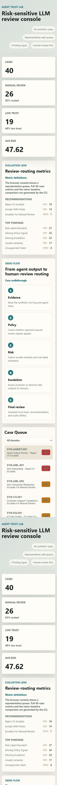

# Demo Screenshots

This page collects the public-safe screenshots that can be used in a portfolio page, resume attachment, or recruiter review packet.

## 1. Desktop Review Console

What it shows:

- browser review console
- representative case queue
- risk score and recommendation
- finding badges
- trust report preview

Best use:

- GitHub README hero screenshot
- portfolio one-pager
- interview walkthrough

## 2. Mobile / Narrow Layout

What it shows:

- responsive narrow-screen layout
- summary metrics
- recommendation distribution
- top finding distribution
- review workflow steps
- case queue preview

Best use:

- proof that the static demo remains readable in a narrow browser panel
- Codex in-app browser validation screenshot
- supplementary portfolio screenshot

## Notes

These screenshots use synthetic public-safe cases only. They do not contain real customer data, private policy, internal labels, secrets, or patent claim text.

