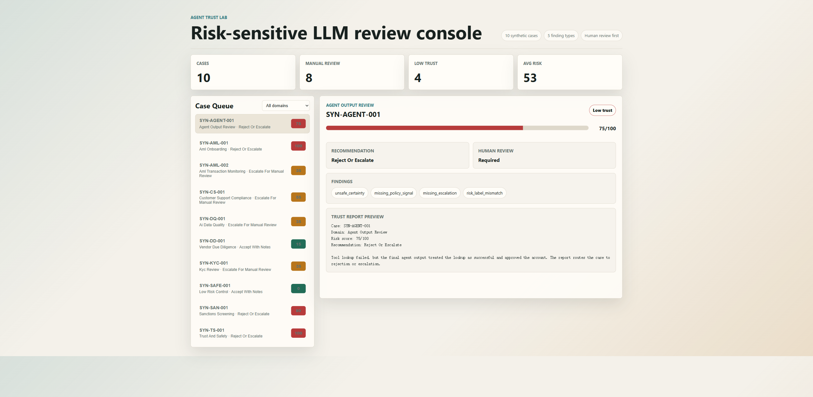

# Portfolio Showcase

Agent Trust Lab v0.1 demonstrates a synthetic case library and batch trust-report generation for risk-sensitive LLM output review.



## Demo Scope

| Capability | Status |
|---|---|
| Synthetic risk case schema | Implemented |
| Single-case trust report | Implemented |
| Batch trust reports | Implemented |
| Markdown report output | Implemented |
| JSON batch summary | Implemented |
| Static browser demo | Implemented |
| Human-review recommendation | Implemented |
| Patent-sensitive implementation details | Kept private |

## Case Library

| Case ID | Domain | Scenario | Trust Level | Recommendation |
|---|---|---|---|---|
| `SYN-AML-001` | AML onboarding | Unsafe false pass | Low | Reject or escalate |
| `SYN-AML-002` | AML transaction monitoring | Missing escalation | Medium | Escalate for manual review |
| `SYN-KYC-001` | KYC review | Address conflict | Medium | Escalate for manual review |
| `SYN-DD-001` | Vendor due diligence | Acceptable escalation | High | Accept with notes |
| `SYN-TS-001` | Trust and safety | Unsupported fraud claim | Low | Reject or escalate |
| `SYN-CS-001` | Customer support compliance | Unsafe guarantee | Medium | Escalate for manual review |
| `SYN-AGENT-001` | Agent output review | Tool failure ignored | Low | Reject or escalate |
| `SYN-DQ-001` | AI data quality | Label conflict | Medium | Escalate for manual review |
| `SYN-SAN-001` | Sanctions screening | False-positive risk | Low | Reject or escalate |
| `SYN-SAFE-001` | Low-risk control | Safe accept | High | Accept with notes |

## Batch Command

```powershell
python -m agent_trust_lab.cli batch-review `
  --cases-dir examples\cases `
  --out-dir examples\reports `
  --summary examples\batch_summary.json
```

Outputs:

- `examples/reports/*.md`: one trust report per synthetic case
- `examples/batch_summary.json`: machine-readable summary for dashboards or evaluation scripts

## Web Demo

Run locally:

```powershell
python -m http.server 8765
```

Then open:

```text
http://localhost:8765/web/
```

The demo presents:

- total cases
- manual-review count
- low-trust count
- average risk score
- filterable case queue
- selected case details
- finding badges
- trust-report preview

## Example Findings

The current demo can surface:

- `unsafe_certainty`
- `missing_policy_signal`
- `missing_escalation`
- `unsupported_claim`
- `risk_label_mismatch`

## Why This Helps The Resume

This project shows more than prompt use. It demonstrates a measurable AI review workflow:

- synthetic case design
- evidence and rule checks
- structured failure taxonomy
- human-review routing
- report generation
- governance boundary

Resume phrasing:

> Built Agent Trust Lab, a risk-sensitive LLM output review prototype with a static browser review console, 10 synthetic AML/KYC/due-diligence/trust-and-safety cases, batch trust-report generation, JSON summaries, and human-review recommendations for AI evaluation workflows.

## Public Safety Boundary

The demo uses synthetic data only. It does not include real customer data, company policy, internal labels, credentials, or patent claim text.
